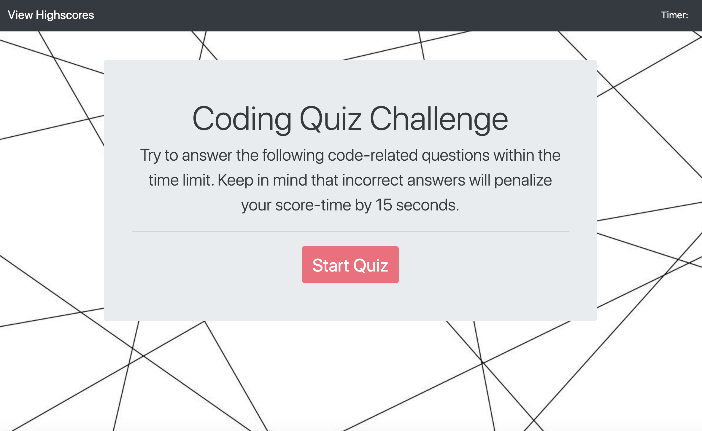
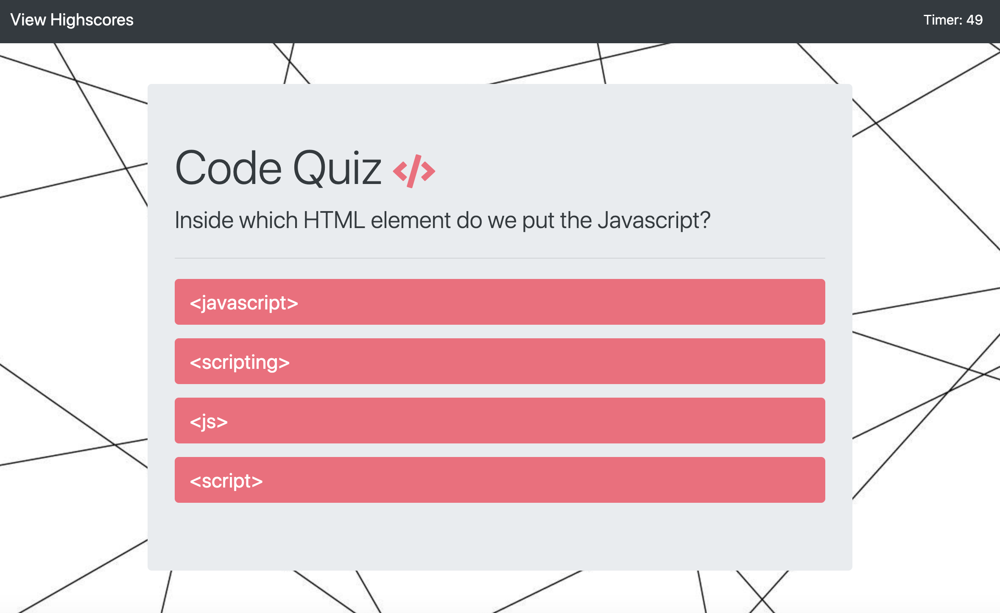
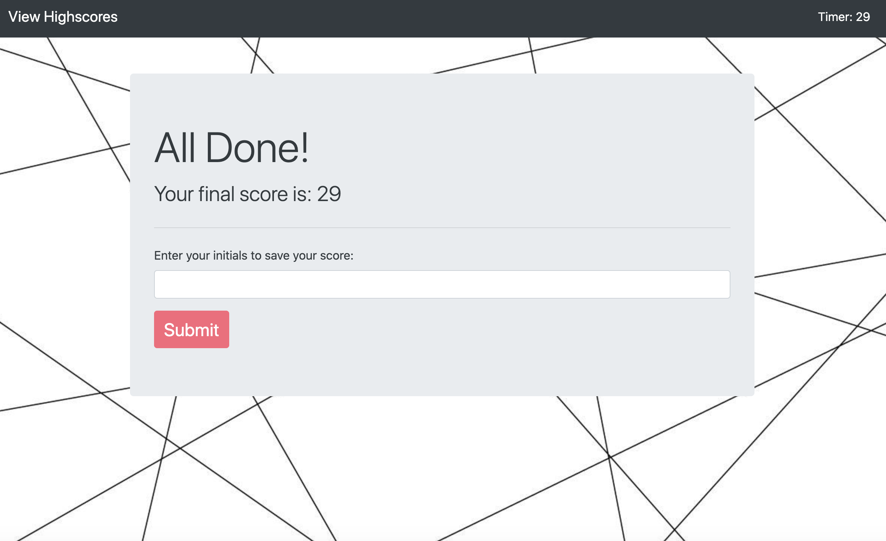
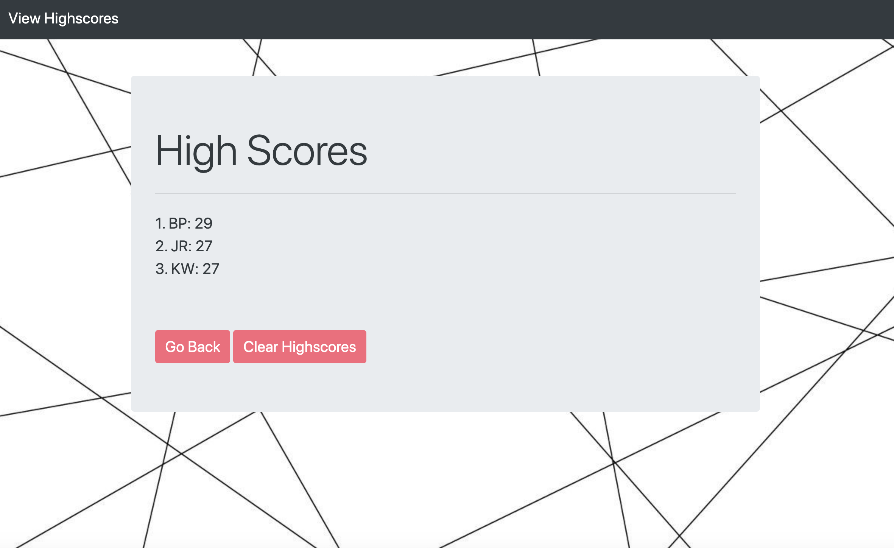

# Code-Quiz

## Table of Contents
* [Description](#description)
* [Visuals](#visuals)
* [Deployed Application](#deployed)
* [Contributing](#contributing)
* [Support](#support)

## Description
Code-Quiz is an interactive application where users have the opportunity to test their JavaScript knowledge in a 5-question, multiple-choice quiz. Users are given 60 seconds to answer all 5 questions and any incorrect answers will penalize the user's score-time by 15 seconds. Upon making it through all questions OR once the timer reaches zero, the user is then presented with a new interface displaying the final score -- in this case, the final count on the timer. This section features an input box where the user can submit his or her initials to have the final score saved to the highscores page.

## Visuals

## Deployed Application
https://barrettpope.github.io/Code-Quiz/

## Contributing
Pull requests are welcome. For major changes, please open an issue first to discuss what you would like to change. 

## Support
For questions, comments or concerns regarding the Code-Quiz application, please email barrettpope94@gmail.com.
